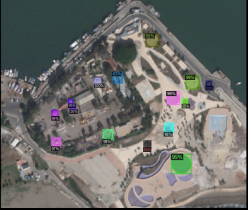

# Circle Finder Challenge (2nd place)

This repository contains my solution to the [Circle Finder Challenge ](https://www.topcoder.com/challenges/d059ceb0-b81f-4769-bb4c-c976e1184d9f?tab=details) (a TopCoder Marathon Match).
The goal of this challenge was to detect **circular shape features** in satellite imagery. These features come in a variety of sizes (from 3m to 300m) and compositions (from vegetation to steel). Examples include agriculture, circular irrigation areas, fuel storage tanks, buildings, traffic circles and fountains.

Panchromatic (PAN) and Multi-spectral (MSI) images were provided as input. My solution first uses **pansharpening** to fuse the information from both types of images. Then, **Faster R-CNN** or **Mask R-CNN** is trained with these images to detect circular shapes.

The final accuracy is 92% on a their secret evaluation dataset.

[National Geospatial-Intelligence Agency (NGA) announcement](https://www.nga.mil/news/1609952228608_NGA_announces_5_winners_in_$50K_in_Circle_Finder_c.html)

- `code` contains the devlopment code.
- `docker` contains the final version of the code (dockerized).
- `submission/solution` contains the final prediction files.
- `old_data` contains old files.

